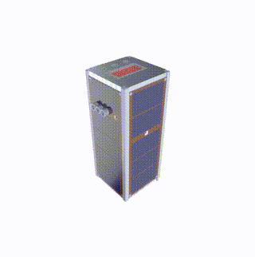

# Welcome to SPARCS Mission!

SPARCS is a multidisciplinary mission in the form of a CubeSat, carried out by a group of undergraduate students from [SUT](https://en.sharif.edu/), known as the **iSSS** team. This mission is progressing with the collaboration of [APSCO](https://www.apsco.int/) and ISA.

Developing, constructing, and testing CubeSats is a challenging endeavor, but we're on our way to space! Join us on this exciting journey, regardless of your affiliation with iSSS—we welcome your contribution.

This project includes the following general phases:
1. [Conceptual Design](https://github.com/SPARCS-Mission/Conceptual-Design)
2. [Preliminary Design](https://github.com/SPARCS-Mission/Preliminary-Design)
3. [Detailed Design](https://github.com/SPARCS-Mission/Detailed-Design)
4. Assembly, Integration & Test
5. Launch
6. In-Orbit Mission
7. Disposal

This mission is for research and technology development purposes. All data and important design files will be made available to everyone as open-source during and after the mission.

**Here's how to [Get Started!](https://github.com/sparcs-mission/getting-started)**

For further contact, email us at sparcs.mission@gmail.com.

<table>
  <tr>
    <td align="center">
      
       
      <figcaption>SPARCS-A 3D Model.</figcaption>
    </td>
    <td align="center">
      
       
      <figcaption>SPARCS-B 3D Model.</figcaption>
    </td>
  </tr>
</table>
</dev>
